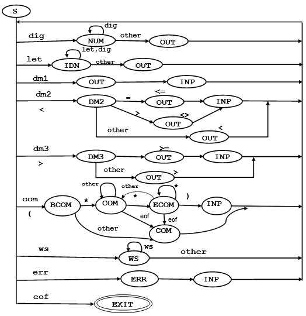
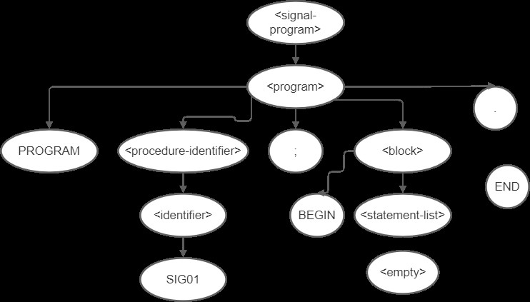
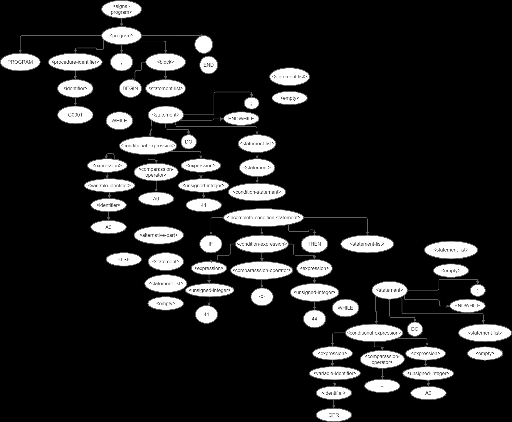

<h1>Compiler for Translating Code from SIGNAL to Assembly Language</h1>

## Table of contents
* [General info](#general-info)
* [Technologies](#technologies)
* [Setup](#setup)
* [Lexer](#lexer)
* [Parser](#parser)
* [Code generator](#code_generator)

## General info
This project includes three separate projects that represent a sequential transition of high-level language translation, involving the processes of parsing, lexical analysis and the final code generator.</p>
	
## Technologies
Project is created with:
* C11: ISO/IEC 9899:2011
* gcc: version 6.3.0
	
## Setup
To run this project, install it using git clone and run a program with the following commands:

```
$ cd ./lexer or ./parser or ./code_generator
$ gcc -o prog main.c lexer.c hash.c log.c
$ .\main --args <arguments represent path to a file with SIGNAL code>
For example, \tests\test01\ \tests\test02\ \tests\test03\
There may be several arguments for generating multiple answers
```
## General overview


<h3>Conditional Operator Grammar</h3>

1. &lt;signal-program&gt; --&gt; &lt;program&gt;
2. &lt;program&gt; --&gt; PROGRAM &lt;procedure-identifier&gt; ; &lt;block&gt;.
3. &lt;block&gt; --&gt; BEGIN &lt;statements-list&gt; END
4. &lt;statements-list&gt; --&gt; &lt;statement&gt; &lt;statements-list&gt; | &lt;empty&gt;
5. &lt;statement&gt; --&gt; &lt;condition-statement&gt; ENDIF ; | WHILE &lt;conditional-expression&gt; DO &lt;statements-list&gt; ENDWHILE ;
6. &lt;condition-statement&gt; --&gt; &lt;incomplete-condition-statement&gt;&lt;alternative-part&gt;
7. &lt;incomplete-condition-statement&gt; --&gt; IF &lt;conditional-expression&gt; THEN &lt;statements-list&gt;
8. &lt;alternative-part&gt; --&gt; ELSE&lt;statements-list&gt; | &lt;empty&gt;
9. &lt;conditional-expression&gt; --&gt; &lt;expression&gt;&lt;comparison-operator&gt; &lt;expression&gt;
10. &lt;comparison-operator&gt; --&gt; &lt; | &lt;= | = | &lt;&gt; | &gt;= | &gt;
11. &lt;expression&gt; --&gt; &lt;variable-identifier&gt; | &lt;unsigned-integer&gt;
12. &lt;variable-identifier&gt; --&gt; &lt;identifier&gt;
13. &lt;procedure-identifier&gt; --&gt; &lt;identifier&gt;
14. &lt;identifier&gt; --&gt; &lt;letter&gt;&lt;string&gt;
15. &lt;string&gt; --&gt; &lt;letter&gt;&lt;string&gt; | &lt;digit&gt;&lt;string&gt; | &lt;empty&gt;
16. &lt;unsigned-integer&gt; --&gt; &lt;digit&gt;&lt;digits-string&gt;
17. &lt;digits-string&gt; --&gt; &lt;digit&gt;&lt;digits-string&gt; | &lt;empty&gt;
18. &lt;digit&gt; --&gt; 0 | 1 | 2 | 3 | 4 | 5 | 6 | 7 | 8 | 9
19. &lt;letter&gt; --&gt; A | B | C | D | ... | Z

## Lexer

<h3>Formulation of the problem</h3>

1. Develop a lexical analyzer (LA) program for a subset of the SIGNAL programming language.
2. The lexical analyzer must provide the following actions:
	- delete (skip) blank characters: space (ASCII code 32), carriage return (ASCII code 13); go to a new line (ASCII code 10), horizontal and vertical tabs (ASCII codes 9 and 11), go to a new page (ASCII code 12);
	- convolution of keywords;
	- folding of multi-character separators (if provided by the grammar of the variant);
	- convolution of constants with entry in the table of values ​​and types of constants (if provided by the grammar of the variant);
	- convolution of identifiers;
	- delete comments specified in the form (* <comment text> *).
 
3. Any high-level algorithmic programming language can be used for programming. If the chosen programming language has constructions or libraries for working with regular expressions, the use of these constructions and / or libraries is strictly prohibited.
4. Recursive algorithms for the implementation of the lexical analyzer are not allowed, regardless of the programming language, due to their catastrophic depth of recursion, which has a linear dependence on the number of tokens of the program. This is unacceptable for large programs.
5. To encode tokens when folding them, it is necessary to use the numerical ranges listed in the following Table.

|                       **Type of token**                       |     **Numerical range**    |
|:-------------------------------------------------------------:|:--------------------------:|
| One-character delimiters and transaction signs (: /; +, etc.) | 0 - 255 (i.e. ASCII codes) |
| Multi-character delimiters (: = <= <= etc.)                   | 301-400                    |
| Keywords (BEGIN, END, FOR, etc.)                              | 401-500                    |
| Constants                                                     | 501-1000                   |
| Identifiers                                                | 1001-...                   |


6. The entrance to the aircraft must be as follows:
	- input program written by a subset of the SIGNAL language according to the variant;
	- table of ASCII codes with attributes for determining tokens (tokens);
	- table of keywords;
	- table of multi-character delimiters (if required);
	- table of constants, in which, if necessary, standard constants can be entered in advance;
	- a table of identifiers, in which, if necessary, pre-defined identifiers are entered.
7. The output of the aircraft should be as follows:
	- coded line of tokens with information about their location in the source program (line number, column number);
	- table of constants, which is formed for a specific program and which contains the value and type of constants;
	- a table of identifiers generated for a specific program.


Let us construct an enlarged graph of the lexical automaton for this example.
The states in the graph are denoted by ellipses. The initial state is indicated by an ellipse with a thick line, and the final "double" ellipse. The states are connected by ribs with labels indicating the transition condition (input symbol of the automaton). Unlabeled ribs indicate an unconditional transition to the state.
In the enlarged graph of the machine, the starting state is denoted by S, the final state - EXIT, the state of input of the next character - INP. Other states correspond to the recognition of the above-defined tokens (tokens) with names that correspond to the names of tokens (number, identity, delimiter1, delimiter2). In addition, there are also additional states (comment, whitespace), which correspond to the processing of other categories of characters (com, ws), from which the original tokens are not formed, but which also need to be processed. The ERR state is entered to process the error found when receiving a character of the category of invalid characters err. It is believed that the output of each of these states, in addition to ERR, will always be a new, still unprocessed, symbol.




The value of the labels on the enlarged graph of the lexical analyzer automaton (categories of input characters):

	- let - category of letters (a .. z);
	- dig - category of digits (0 .. 9);
	- dm1 - category of one-character delimiters (=);
	- dm2 - category of multi-character separators (<=);
	- com - category of initial comment characters ()
	- ws - category of space characters;
	- err - category of invalid characters;
	- eof - end of file character.
The values ​​of the states on the enlarged graph of the lexical analyzer automaton:

	- S - starting state (state of the machine graph at the time of the start of operation of the aircraft);
	- EXIT - the final state of the aircraft;
	- INP - input of the next character;
	- number - selection and processing of the token number;
	- identifier - selection and processing of the token identifier;
	- delimiter1 - selection and processing of the token delimiter1;
	- delimiter2 - selection and processing of the token delimiter2;
	- comment - selection and processing of comments;
	- whitespace - selection and processing of blank characters;
	- ERR - issue an error message.


<h4> An example of the output on the given listing of a program</h4>

__FALSE TEST ON COMMENTS__:

```
(*.	)(*aaa
)*
*> AFGF *)

END (* *
)
```

__Output after an execution__:
 
```
1	1	1001	FALSE
1	7	1002	TEST
1	12	1003	ON
1	15	1004	COMMENTS
6	1	403	END
"Lexer: Error (line 7, column 2): Expected '*)' but end of file has occured"

Table of constants:

Table of identificators: 1001 FALSE
1002 TEST
 
1003 ON
1004 COMMENTS
```


__TRUE TEST ON GRAMMAR PROGRAM SOMEIDN23__

```
BEGIN FORPOST = 2346;
BAG = 2 END
IF FORPOST <> 345 THEN PRINT
ELSE
WHILE BUG DO
CALCULATION

ENDWHILE ; ; ENDIF;

IF A < B > C <= F = T <> L >= Y ; 545
344
43
END
```


__Output after an execution__:

```
1	1	1001	TRUE
1	6	1002	TEST
1	11	1003	ON
 
1	14	1004	GRAMMAR
2	1	401	PROGRAM
2	9	1005	SOMEIDN23
2	18	59	;
3	2	402	BEGIN
4	1	1006	FORPOST
4	9	61	=
4	11	501	2346
4	15	59	;
5	1	1007	BAG
5	5	61	=
5	7	502	2
6	1	403	END
7	1	408	IF
7	4	1006	FORPOST
7	12	302	<>
7	15	503	345
7	19	409	THEN
8	2	1008	PRINT
9	1	410	ELSE
10	2	405	WHILE
10	8	1009	BUG
10	12	406	DO
11	1	1010	CALCULATION
13	1	407	ENDWHILE
13	10	59	;
13	12	59	;
14	1	404	ENDIF
14	6	59	;
16	1	408	IF
16	4	1011	A
16	6	60	<
16	8	1012	B
16	10	62	>
16	12	1013	C
16	14	301	<=
16	17	1014	F
16	19	61	=
16	21	1015	T
16	23	302	<>
16	26	1016	L
16	28	303	>=
16	31	1017	Y
16	33	59	;
17	1	504	545
18	2	505	344
19	2	506	43
20	1	403	END

Table	
of constants:
501	2346
502	2
503	345
 
504	545
505	344
506	43

Table of identificators:
1001 TRUE
1002 TEST
1003 ON
1004 GRAMMAR
1005 SOMEIDN23
1006 FORPOST
1007 BAG
1008 PRINT
1009 BUG
1010 CALCULATION
1011 A
1012 B
1013 C
1014 F
1015 T
1016 L
1017 Y
```


## Parser

<h3 align = "center">Parsing algorithm</h3>

<b>Descending analysis by recursive descent algorithm</b>


**The method of recursive descent implements irreversible analysis due to the following restrictions on grammar rules**:
1. Rules must not contain left-handed recursion. If such rules exist, they are replaced by rules with right-hand recursion or presented in iterative form.
2. If there are several rules with the same left part, the right part should start with different terminal symbols (normal Greybach form).

**The essence of the method**: each non-terminal grammar corresponds to a procedure or function.

<h4>Formulation of the problem</h4>

1. Develop a parser program (CA) for a subset of the SIGNAL programming language according to the grammar of the option.
2. The program should provide the following:
	- reading a line of tokens and tables generated by a lexical analyzer, which was developed in the laboratory work "Development of a lexical analyzer";
	- parsing (parsing) of the program presented by the token string (the parser algorithm is selected by option);
	- construction of a parsing tree;
	- formation of tables of identifiers and various constants with complete information needed to generate code;
	- formation of listing of the incoming program with reports of lexical and syntactic errors.
 
3. Any high-level algorithmic programming language can be used for programming. If the chosen programming language has constructions or libraries for working with regular expressions, the use of these constructions and / or libraries is strictly prohibited.
4. The input of the parser should be as follows:
	- coded string of tokens;
	- tables of identifiers, numerical, symbolic and string constants (if provided by the grammar of the variant), generated by the lexical analyzer;
	- input program on a subset of the SIGNAL programming language according to the variant (required for generating the program list).
5. The output of the parser should be the following:
	- input program parsing tree;
	- tables of identifiers and various constants with complete information needed to generate code;
	- listing the incoming program with lexical and syntactic error messages.


**Test 1**

```
2	1	401	PROGRAM
2	9	1001	SIG01
2	14	59	;
3	1	402	BEGIN
4	1	403	END
4	4	46	.
Table of identificators: 1001 SIG01

Parse tree:
<signal-program>
..<program>
....401 PROGRAM
....<procedure-identifier>
......<identifier>
........1001 SIG01
....59 ;
....<block>
......402 BEGIN
......<statement-list>
........<empty>
......403 END
....46 .
```




**Test 2**

```
2	1	401	PROGRAM
2	9	1001	G0001
2	14	59	;
3	1	402	BEGIN
4	1	405	WHILE
4	8	1002	A0
4	11	301	<=
4	14	501	44
5	1	406	DO
6	1	408	IF
6	4	501	44
6	7	302	<>
 
6	10	501	44
7	1	409	THEN
8	1	405	WHILE
8	7	1003	GPR
8	11	61	=
8	13	1002	A0
9	1	406	DO
10	1	407	ENDWHILE
10	9	59	;
11	1	410	ELSE
12	1	404	ENDIF
12	6	59	;
13	1	407	ENDWHILE
13	9	59	;
14	1	403	END
14	4	46	.

Table of constants:
501	44

Table of identificators:
1001 G0001
1002 A0
1003 GPR

Parse tree:
<signal-program>
..<program>
....401 PROGRAM
....<procedure-identifier>
......<identifier>
........1001 G0001
....59 ;
....<block>
......402 BEGIN
......<statement-list>
........<statement>
..........405 WHILE
..........<conditional-expression>
............<expression>
..............<variable-identifier>
................<identifier>
..................1002 A0
............<comparassion operator>
..............301 <=
............<expression>
..............<unsigned-integer>
................501 44
..........406 DO
..........<statement-list>
............<statement>
..............<condition-statement>
................<incomplete-condition-statement>
..................408 IF
..................<conditional-expression>
....................<expression>
......................<unsigned-integer>
........................501 44
 
....................<comparassion operator>
......................302 <>
....................<expression>
......................<unsigned-integer>
........................501 44
..................409 THEN
..................<statement-list>
....................<statement>
......................405 WHILE
......................<conditional-expression>
........................<expression>
..........................<variable-identifier>
............................<identifier>
..............................1003 GPR
........................<comparassion operator>
..........................61 =
........................<expression>
..........................<variable-identifier>
............................<identifier>
..............................1002 A0
......................406 DO
......................<statement-list>
........................<empty>
......................407 ENDWHILE
......................59 ;
....................<statement-list>
......................<empty>
................<alternative-part>
..................410 ELSE
..................<statement-list>
....................<empty>
..............404 ENDIF
..............59 ;
............<statement-list>
..............<empty>
..........407 ENDWHILE
..........59 ;
........<statement-list>
..........<empty>
......403 END
....46 .
```




## Code generator

<h4>Formulation of the problem</h4>

1. Develop a code generator program (CG) for a subset of the SIGNAL programming language specified in the option.
2. The program must provide:
	- reading the parsing tree and tables created by the parser, which was developed in the calculation and graphics work;
	- detection of semantic errors;
	- code generation and / or construction of internal tables for code generation.
3. The input of the code generator (GC) should be:
	- parsing tree;
	- tables of identifiers and constants with complete information needed to generate code;
	- input program on a subset of the SIGNAL programming language according to the option (required for generating the program listing).
 
4. The output of the Civil Code should be:
	- assembly code generated for the input program and / or internal tables for code generation;
	- internal code generator tables (if required).
5. Compose a complete compiler, consisting of previously developed lexical and syntactic analyzers and code generator, which provides the following:
	- code generation and / or construction of internal tables for code generation;
	- formation of listing of the incoming program with messages about lexical, syntactic and semantic errors.
6. The compiler input must be a program on a subset of the SIGNAL programming language according to the variant;
7. The output of the compiler should be:
	- assembly code generated for the input program and / or internal tables for code generation;
	- listing of the input program with reports of lexical, syntactic and semantic errors.
8. Any high-level algorithmic programming language can be used for programming. If the chosen programming language has constructions or libraries for working with regular expressions, the use of these constructions and / or libraries is strictly prohibited.

<h3 align = "center">List of constraints</h3>

<b>- it is not allowed to use the same names for the procedure and any variable or constant;</b>

<b>- it is not allowed to use the same names for two or more constants in one subroutine or globally;</b>

<b>- it is not allowed to use the same names for two or more labels</b>

<b>- the names of the generated labels must not coincide with the names of variables and constants in the same subroutine and with external names at the global level.</b>


**Test 1**

**Content of the file “input.sig”**

```
(*+ TEST1*) PROGRAM SIG01; BEGIN
WHILE A0 <= 44 DO
 
IF 44 <> 44 THEN
WHILE GPR = A0 DO
 
ENDWHILE; WHILE GPR = A0 DO
ENDWHILE;
ENDIF;
IF 44 <>	44
THEN	
ENDIF;	
ENDWHILE;	
WHILE GPR = A0	
DO	
ENDWHILE;	
IF 44 <> 44	
THEN	
ELSE	
ENDIF;	
END.	
```

**Content of the file “generated.txt”**

```
2	1	401	PROGRAM		
2	9	1001	SIG01		
2	14	59	;		
3	1	402	BEGIN		
4	1	405	WHILE		
4	8	1002	A0		
4	11	301	<=		
4	14	501	44		
5	1	406	DO		
6	2	408	IF		
6	5	501	44		
6	8	302	<>		
6	11	501	44		
7	2	409	THEN		
8	3	405	WHILE		
8	9	1003	GPR		
8	13	61	=		
8	15	1002	A0		
9	3	406	DO		
10	3	407	ENDWHILE		
10	11	59	;		
11	3	405	WHILE		
11	9	1003	GPR		
11	13	61	=		
11	15	1002	A0		
12	3	406	DO		
13	3	407	ENDWHILE		
13	11	59	;		
14	2	404	ENDIF		
14	7	59	;		
15	2	408	IF		
15	5	501	44		
15	8	302	<>		
15	11	501	44		
16	2	409	THEN		
17	2	404	ENDIF		
17	7	59	;		
18	1	407	ENDWHILE		
18	9	59	;		
19	1	405	WHILE		
 
19	7	1003	GPR
19	11	61	=
19	13	1002	A0
20	3	406	DO
21	1	407	ENDWHILE
21	9	59	;
22	1	408	IF
22	4	501	44
22	7	302	<>
22	10	501	44
23	2	409	THEN
24	1	410	ELSE
25	1	404	ENDIF
25	6	59	;
26	1	403	END
26	4	46	.

Table of constants:
501	44

Table of identificators:
1001 SIG01
1002 A0
1003 GPR

Parse tree:
<signal-program>
..<program>
....401 PROGRAM
....<procedure-identifier>
......<identifier>
........1001 SIG01
....59 ;
....<block>
......<constant-declarations>
........<empty>
......402 BEGIN
......<statement-list>
........<statement>
..........405 WHILE
..........<conditional-expression>
............<expression>
..............<variable-identifier>
................<identifier>
..................1002 A0
............<comparassion operator>
..............301 <=
............<expression>
..............<unsigned-integer>
................501 44
..........406 DO
..........<statement-list>
............<statement>
..............<condition-statement>
................<incomplete-condition-statement>
..................408 IF
..................<conditional-expression>
....................<expression>
 
......................<unsigned-integer>
........................501 44
....................<comparassion operator>
......................302 <>
....................<expression>
......................<unsigned-integer>
........................501 44
..................409 THEN
..................<statement-list>
....................<statement>
......................405 WHILE
......................<conditional-expression>
........................<expression>
..........................<variable-identifier>
............................<identifier>
..............................1003 GPR
........................<comparassion operator>
..........................61 =
........................<expression>
..........................<variable-identifier>
............................<identifier>
..............................1002 A0
......................406 DO
......................<statement-list>
........................<empty>
......................407 ENDWHILE
......................59 ;
....................<statement-list>
......................<statement><statement>
........................405 WHILE
........................<conditional-expression>
..........................<expression>
............................<variable-identifier>
..............................<identifier>
................................1003 GPR
..........................<comparassion operator>
............................61 =
..........................<expression>
............................<variable-identifier>
..............................<identifier>
................................1002 A0
........................406 DO
........................<statement-list>
..........................<empty>
........................407 ENDWHILE
........................59 ;
......................<statement-list>
........................<statement><statement><empty>
................<alternative-part>
..................<empty>
..............404 ENDIF
..............59 ;
............<statement-list>
..............<statement><statement>
................<condition-statement>
..................<incomplete-condition-statement>
....................408 IF
....................<conditional-expression>
 
......................<expression>
........................<unsigned-integer>
..........................501 44
......................<comparassion operator>
........................302 <>
......................<expression>
........................<unsigned-integer>
..........................501 44
....................409 THEN
....................<statement-list>
......................<empty>
..................<alternative-part>
....................<empty>
................404 ENDIF
................59 ;
..............<statement-list>
................<statement><statement><empty>
..........407 ENDWHILE
..........59 ;
........<statement-list>
..........<statement><statement>
............405 WHILE
............<conditional-expression>
..............<expression>
................<variable-identifier>
..................<identifier>
....................1003 GPR
..............<comparassion operator>
................61 =
..............<expression>
................<variable-identifier>
..................<identifier>
....................1002 A0
............406 DO
............<statement-list>
..............<empty>
............407 ENDWHILE
............59 ;
..........<statement-list>
............<statement><statement><statement>
..............<condition-statement>
................<incomplete-condition-statement>
..................408 IF
..................<conditional-expression>
....................<expression>
......................<unsigned-integer>
........................501 44
....................<comparassion operator>
......................302 <>
....................<expression>
......................<unsigned-integer>
........................501 44
..................409 THEN
..................<statement-list>
....................<empty>
................<alternative-part>
..................410 ELSE
..................<statement-list>
 
....................<empty>
..............404 ENDIF
..............59 ;
............<statement-list>
..............<statement><statement><statement><empty>
......403 END
....46 .


;SIG01
DATA SEGMENT
NOP DATA ENDS

CODE SEGMENT
ASSUME DS: DATA CS:CODE START:
MOV AX, DATA MOV DS, AX XOR AX, AX
CALL SIG01


?L1: NOP
"Code Generator: Error (line 4, column 8): var 'A0' is undefined" MOV BX, 44
CMP AX, BX JG ?L2

MOV AX, 44
MOV BX, 44 CMP AX, BX JE ?L3

?L4: NOP
"Code Generator: Error (line 8, column 9): var 'GPR' is undefined" "Code Generator: Error (line 8, column 15): var 'A0' is undefined"
CMP AX, BX JNE ?L5 NOP
JMP ?L4
?L5: NOP

?L6: NOP
"Code Generator: Error (line 11, column 9): var 'GPR' is undefined" "Code Generator: Error (line 11, column 15): var 'A0' is undefined"
CMP AX, BX JNE ?L7 NOP
JMP ?L6
?L7: NOP
NOP
?L3: NOP

MOV AX, 44
MOV BX, 44 CMP AX, BX JE ?L8
 
NOP
?L8: NOP
NOP
JMP ?L1
?L2: NOP

?L9: NOP
"Code Generator: Error (line 19, column 7): var 'GPR' is undefined" "Code Generator: Error (line 19, column 13): var 'A0' is undefined"
CMP AX, BX JNE ?L10 NOP
JMP ?L9
?L10: NOP

MOV AX, 44
MOV BX, 44 CMP AX, BX JE ?L11 NOP
JMP ?L12
?L11: NOP
NOP
?L12: NOP
NOP
RET
MOV AX, 4C00H INT 21H
CODE ENDS END START
```

**Test 2**

** Content of the file “input.sig”**

```
(*+ TEST7 - lexem name repetition FALSE+*) PROGRAM 0G0001;
CONST 0G0001 = 4; BEGIN
END.
 

2	1	401	PROGRAM
```


** Content of the file “generated.txt”**

``` 
2	9	501	0
2	10	1001	G0001
2	15	59	;
3	1	411	CONST
4	1	501	0
4	2	1001	G0001
4	8	61	=
4	11	502	4
4	12	59	;
5	1	402	BEGIN
6	1	403	END
6	4	46	.

Table of constants:
501	0
502	4

Table of identificators:
1001 G0001

Parse tree:
<signal-program>
..<program>
....401 PROGRAM
....<procedure-identifier>
......<identifier>
........<error>
"Parser: Error (line 2, column 9): 'identifier' expected but '0' found"
```
